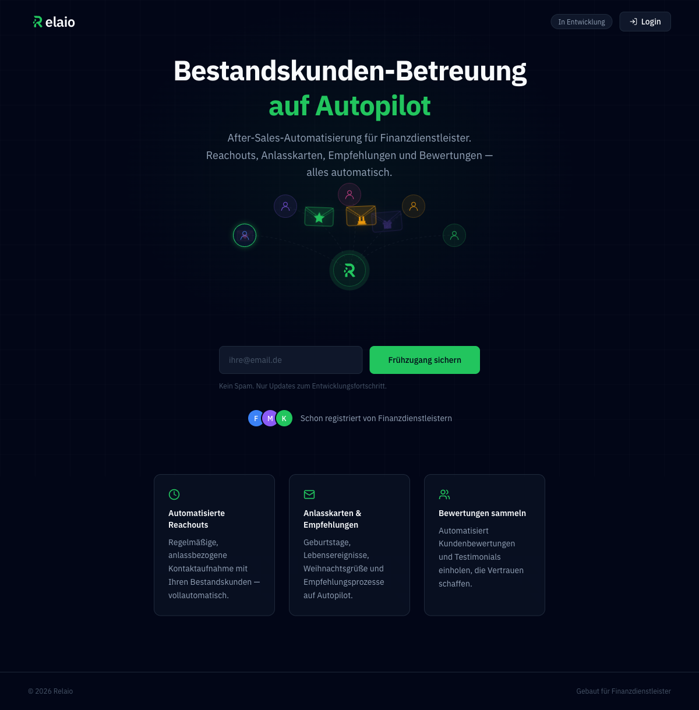
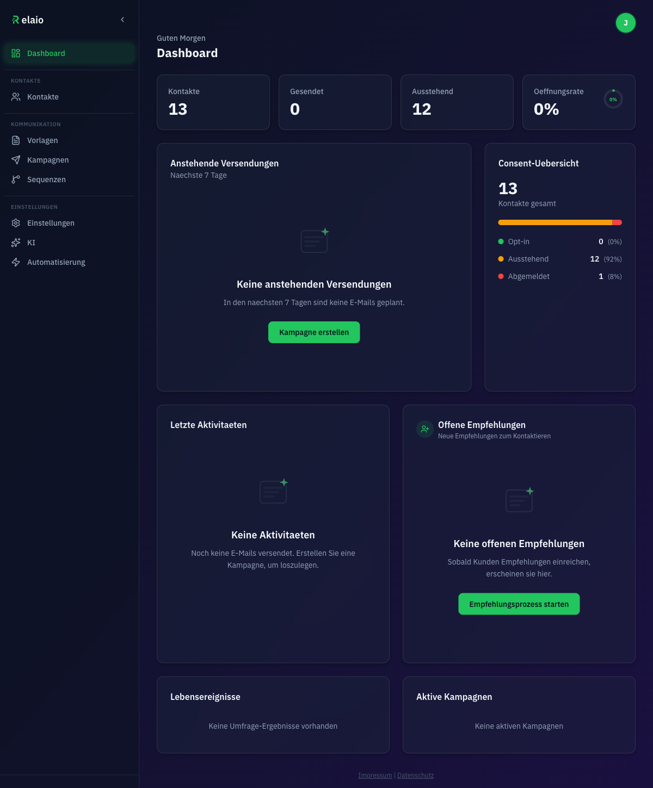
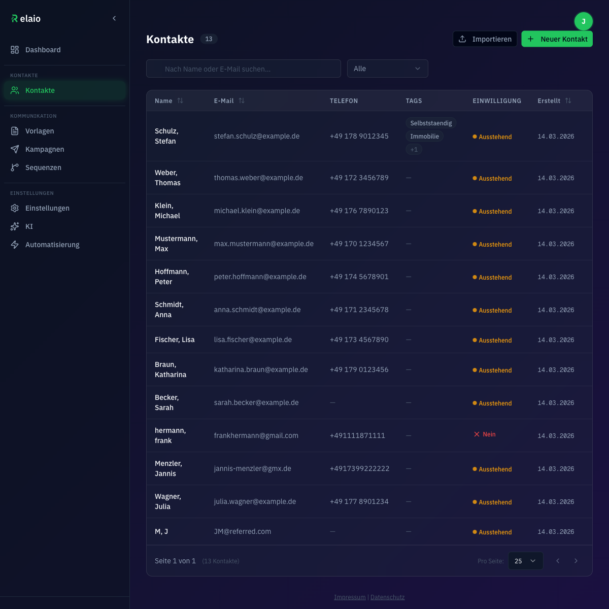
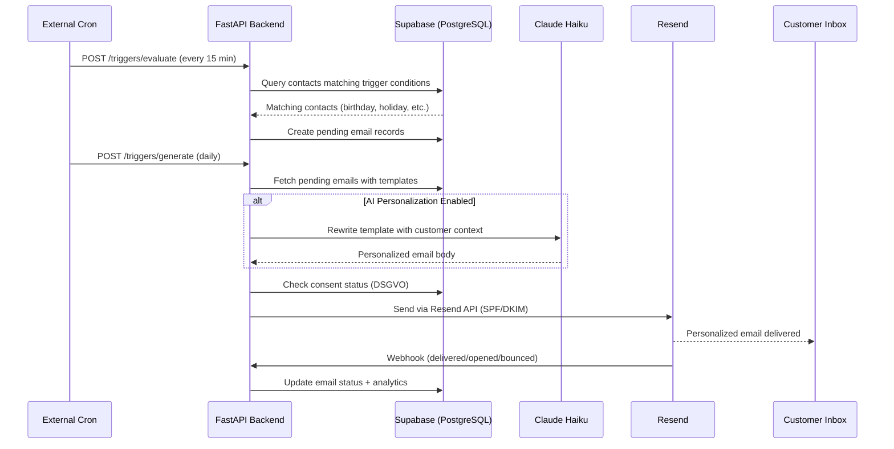
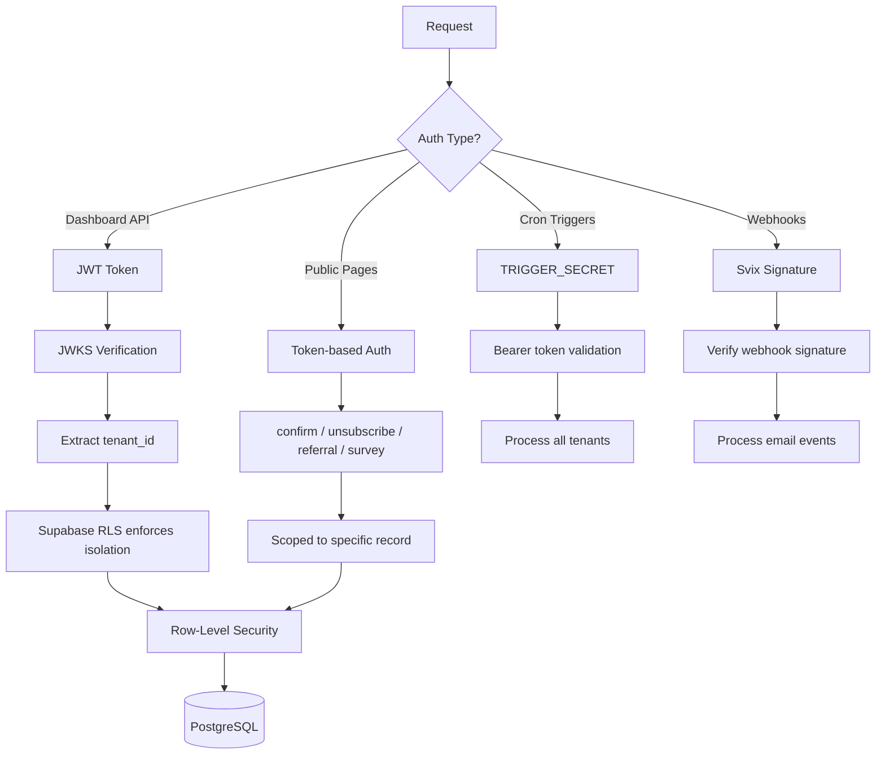

# Relaio — After-Sales Automation for Financial Advisors

<p align="center">
  
</p>

**Relaio** automates the entire existing-customer care process for insurance brokers and small financial advisory firms in Germany. Birthday greetings, holiday cards, service appointment reminders, referral campaigns, review collection, and cross-selling surveys — all on autopilot.

> This is a portfolio showcase of a private project. The source code is not publicly available.

---

## The Problem

Solo insurance brokers and small firms (1-5 people) manage 200-1,000 existing customers. After-sales care — staying in touch, collecting referrals, gathering reviews — is critical for retention and growth, but extremely time-consuming when done manually. Most brokers either neglect it entirely or spend hours on repetitive, low-value tasks.

## The Solution

Relaio provides a single dashboard where financial advisors can:

- **Import their customer base** (CSV/Excel or manual entry)
- **Configure automation triggers** (birthdays, holidays, welcome emails, service reminders)
- **Create and manage email templates** with AI-powered personalization
- **Run one-off campaigns** targeting specific customer segments
- **Build multi-step sequences** with conditional logic (email → wait → condition → email)
- **Collect referrals and reviews** automatically through personalized landing pages
- **Track consent (DSGVO/GDPR)** with full audit trail and double opt-in

All emails are personalized by AI (Claude Haiku) based on the advisor's brand voice, tone preferences, and customer context.

---

## Screenshots

<details>
<summary><strong>Dashboard</strong> — KPIs, upcoming sends, consent overview, recent activity</summary>
<br />

</details>

<details>
<summary><strong>Contacts</strong> — Sortable data table with consent status, tags, search & filters</summary>
<br />

</details>

---

## Architecture

```
┌─────────────────────────────────────────────────────────────────┐
│                         Vercel (Frontend)                       │
│                                                                 │
│   Next.js 16 · React 19 · Tailwind CSS 4 · shadcn/ui          │
│   App Router · Server Components · Framer Motion               │
│                                                                 │
│   Dashboard │ Contacts │ Templates │ Campaigns │ Sequences     │
│   Settings  │ AI Config │ Automation │ CSV Import              │
└──────────────────────────┬──────────────────────────────────────┘
                           │ REST API (JWT)
                           ▼
┌─────────────────────────────────────────────────────────────────┐
│                      Hetzner VPS (Backend)                      │
│                                                                 │
│   FastAPI · Python 3.13 · Pydantic v2 · Docker · Caddy         │
│                                                                 │
│   ┌─────────────┐  ┌──────────────┐  ┌──────────────────┐     │
│   │   Routers   │  │   Services   │  │      Core        │     │
│   │             │  │              │  │                  │     │
│   │ contacts    │  │ automation   │  │ JWT auth (JWKS)  │     │
│   │ templates   │  │ consent      │  │ config           │     │
│   │ campaigns   │  │ ai_rewrite   │  │ dependencies     │     │
│   │ sequences   │  │ email        │  │ rate limiting    │     │
│   │ triggers    │  │ referral     │  │ CORS             │     │
│   │ settings    │  │ survey       │  │                  │     │
│   │ webhooks    │  │ sequence     │  │                  │     │
│   └─────────────┘  └──────────────┘  └──────────────────┘     │
└──────────────────────────┬──────────────────────────────────────┘
                           │
              ┌────────────┼────────────┐
              ▼            ▼            ▼
     ┌──────────────┐ ┌─────────┐ ┌──────────┐
     │   Supabase   │ │ Resend  │ │  Claude   │
     │  PostgreSQL  │ │  Email  │ │  Haiku    │
     │     + RLS    │ │  + DKIM │ │   (AI)    │
     └──────────────┘ └─────────┘ └──────────┘
```

### Data Flow: Automated Email Lifecycle



### Multi-Tenant Security Model



---

## Key Features

### Automation Engine
- **Event-based triggers**: Birthday, holiday/Christmas, welcome, service appointment, referral request, review collection
- **Configurable scheduling**: Follow-up count, spacing, holiday windows
- **Multi-step sequences**: Email → Wait → Condition → Email chains with enrollment tracking
- **DSGVO dispatch guard**: Consent verification before every send

### AI Email Personalization
- **Claude Haiku integration**: Rewrites template emails with customer-specific context
- **Configurable voice**: Formal ("Sie") or informal ("Du") tone
- **Per-trigger toggle**: Enable/disable AI per automation type
- **Graceful fallback**: Returns original template on any AI error — email delivery never fails

### Contact Management
- **CSV/Excel import** with automatic encoding detection and column mapping
- **Consent lifecycle**: Full DSGVO-compliant double opt-in with audit trail
- **Tags and notes**: Organize and annotate customer records
- **Life event tracking**: Survey-based detection of cross-selling opportunities

### Campaign & Communication
- **One-off campaigns**: Target by tags, life events, consent status
- **Email templates**: Per-trigger-type templates with variable substitution
- **Analytics**: Sent, delivered, opened, clicked, bounced — per email and aggregate
- **Webhook processing**: Real-time delivery status via Resend webhooks

### Public Customer-Facing Pages
- **Consent confirmation**: Double opt-in landing page
- **Unsubscribe**: One-click unsubscribe with reason collection
- **Referral landing**: Branded page for customers to submit referrals
- **Survey**: Cross-selling life event survey

---

## Tech Stack

| Layer | Technology |
|-------|-----------|
| **Frontend** | Next.js 16, React 19, Tailwind CSS 4, shadcn/ui, TanStack Table, Framer Motion |
| **Backend** | Python 3.13, FastAPI, Pydantic v2, supabase-py |
| **Database** | PostgreSQL via Supabase with Row-Level Security |
| **Auth** | Supabase Auth (frontend) + JWKS JWT verification (backend) |
| **Email** | Resend with SPF/DKIM, Svix webhook verification |
| **AI** | Claude Haiku for email personalization |
| **Infrastructure** | Vercel (frontend), Hetzner VPS with Docker + Caddy (backend) |
| **CI/CD** | GitHub Actions (ruff, mypy, pytest, eslint, tsc) |
| **Migrations** | Alembic with raw SQL |

---

## Development Highlights

- **132+ backend tests** with pytest covering all services and API endpoints
- **Full DSGVO/GDPR compliance**: Cookie consent, double opt-in, unsubscribe, data processing records
- **Multi-tenant isolation** via PostgreSQL Row-Level Security — no tenant can access another's data
- **Rate limiting** with slowapi to prevent API abuse
- **Security hardened**: CORS, CSRF protection, input validation, secure headers
- **Design system**: Custom theme with dark/light mode, consistent tokens, animated transitions
- **Responsive UI**: Mobile-friendly dashboard with collapsible sidebar

---

## Status

Currently in private beta with select financial advisors in Germany. The waitlist is open at the landing page.

---

<p align="center">
  <sub>Built by <a href="https://github.com/jmenzler">Jannis Menzler</a></sub>
</p>
