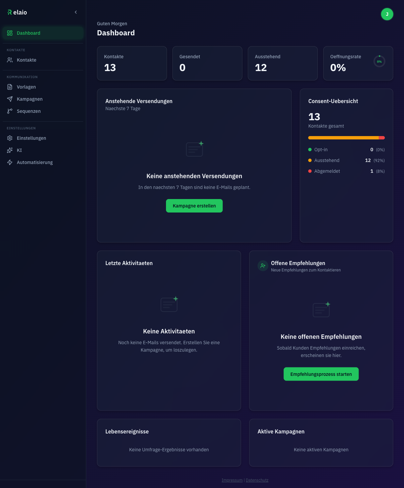
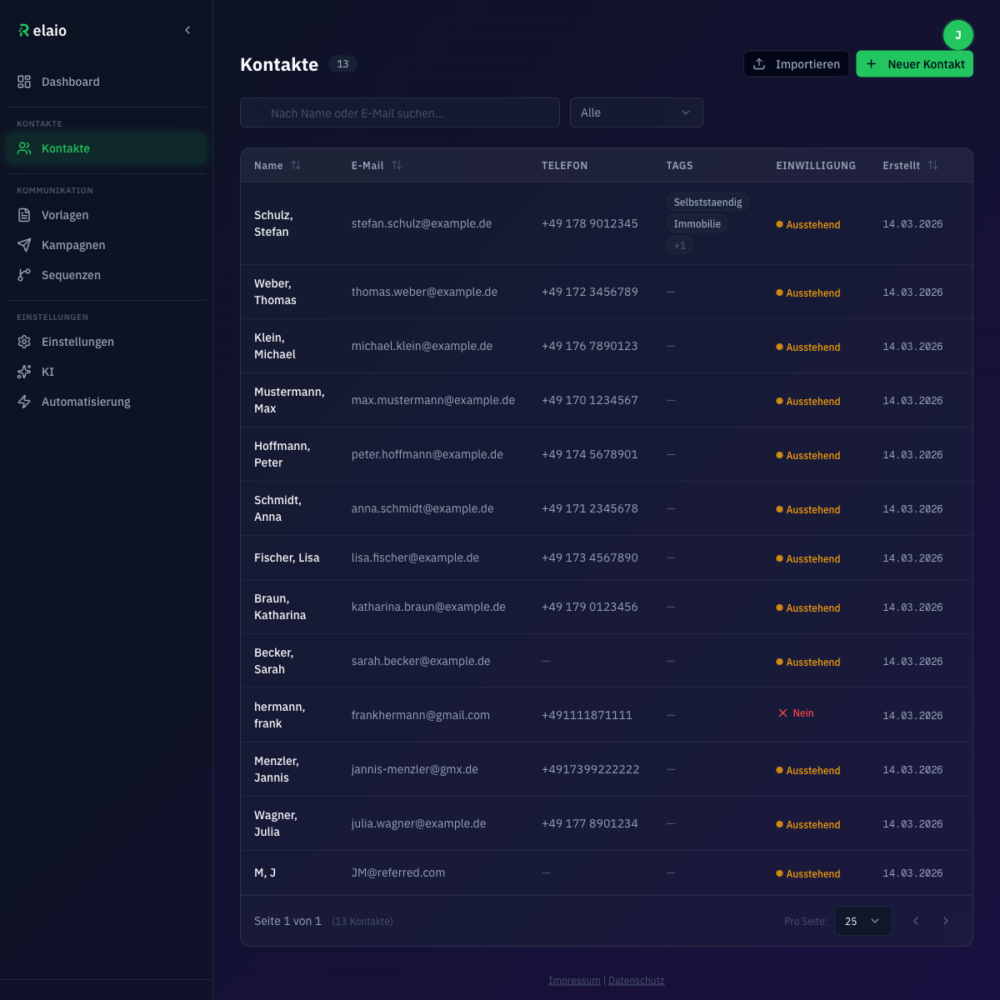
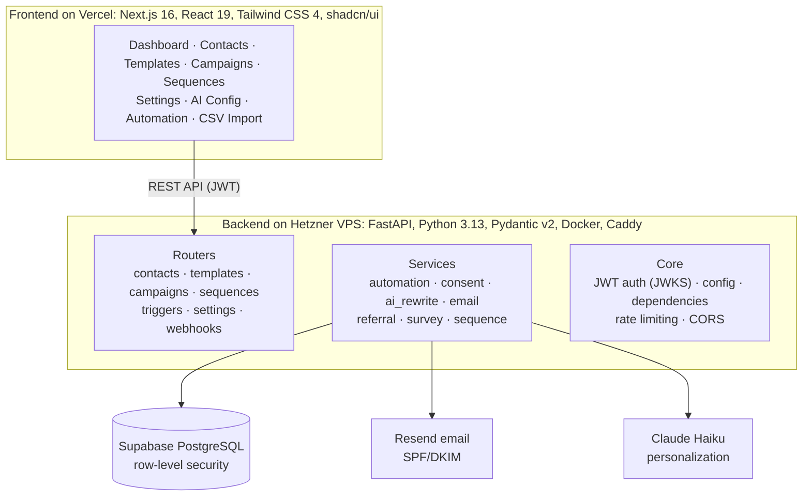

# Relaio: after-sales automation for insurance brokers

Web app that automates existing-customer care for German insurance brokers and small advisory firms: birthday and holiday emails, service reminders, referral and review requests, and multi-step email sequences, with GDPR consent tracking built in. Each email can be personalized per customer with Claude Haiku.

**Tech:** Python · FastAPI · Next.js + React · TypeScript · PostgreSQL (Supabase, RLS) · Claude API · Docker + Caddy

  

> Portfolio case study of a private project. The source code is not public.

---

## The problem

Solo insurance brokers and small firms (1-5 people) look after 200-1,000 existing customers. Staying in touch, asking for referrals and collecting reviews is what keeps those customers, but done by hand it takes hours every week, so most brokers skip it.

## What it does

Advisors import their customers from CSV or Excel, choose which events trigger an email (birthdays, holidays, welcome, service reminders) and let Relaio send them. They can also run one-off campaigns for a segment or build multi-step sequences (email, wait, condition, email). Referrals and reviews come in through personalized landing pages, and consent is tracked with double opt-in and an audit trail.

Claude Haiku rewrites each template for the customer, in the advisor's tone: formal "Sie" or informal "Du". If the AI call fails, the original template goes out instead.

---

## Screenshots

<strong>Dashboard</strong>: KPIs, upcoming sends, consent overview, recent activity

 

<strong>Contacts</strong>: sortable data table with consent status, tags, search & filters

 

---

## Architecture

```mermaid
flowchart TB
    subgraph FE["Frontend on Vercel: Next.js 16, React 19, Tailwind CSS 4, shadcn/ui"]
        pages["Dashboard · Contacts · Templates · Campaigns · Sequences<br/>Settings · AI Config · Automation · CSV Import"]
    end
    subgraph BE["Backend on Hetzner VPS: FastAPI, Python 3.13, Pydantic v2, Docker, Caddy"]
        routers["Routers<br/>contacts · templates · campaigns · sequences<br/>triggers · settings · webhooks"]
        services["Services<br/>automation · consent · ai_rewrite · email<br/>referral · survey · sequence"]
        core["Core<br/>JWT auth (JWKS) · config · dependencies<br/>rate limiting · CORS"]
    end
    pages -- "REST API (JWT)" --> routers
    services --> db[("Supabase PostgreSQL<br/>row-level security")]
    services --> mail["Resend email<br/>SPF/DKIM"]
    services --> ai["Claude Haiku<br/>personalization"]
```

---

## Features

**Automation.** Triggers cover birthdays, holidays, welcome mails, service appointments, referral requests and review collection. Follow-up count, spacing and holiday windows are configurable, sequences track enrollment, and a DSGVO guard checks consent before every send.

**AI personalization.** Claude Haiku rewrites templates with customer context. Tone is set per advisor, and AI can be switched off per trigger type.

**Contacts.** The CSV/Excel import detects encodings and maps columns. Consent follows a double opt-in lifecycle with an audit trail, records get tags and notes, and a survey picks up life events that point to cross-selling.

**Campaigns.** One-off campaigns target by tags, life events or consent status. Templates exist per trigger type with variable substitution. Resend webhooks report sent, delivered, opened, clicked and bounced, per email and in aggregate.

**Public pages.** Customers see a double opt-in confirmation page, a one-click unsubscribe that asks for a reason, a branded referral form and the life-event survey.

---

## Tech stack

| Layer | Technology |
|-------|-----------|
| **Frontend** | Next.js 16, React 19, Tailwind CSS 4, shadcn/ui, TanStack Table, Framer Motion |
| **Backend** | Python 3.13, FastAPI, Pydantic v2, supabase-py |
| **Database** | PostgreSQL via Supabase with Row-Level Security |
| **Auth** | Supabase Auth (frontend) + JWKS JWT verification (backend) |
| **Email** | Resend with SPF/DKIM, Svix webhook verification |
| **AI** | Claude Haiku for email personalization |
| **Infrastructure** | Vercel (frontend), Hetzner VPS with Docker + Caddy (backend) |
| **CI/CD** | GitHub Actions (ruff, mypy, pytest, eslint, tsc) |
| **Migrations** | Alembic with raw SQL |

---

## Engineering notes

- 132+ backend tests (pytest) across services and API endpoints.
- Multi-tenant isolation through PostgreSQL row-level security.
- DSGVO/GDPR handling: cookie consent, double opt-in, unsubscribe and records of processing.
- Rate limiting (slowapi), CORS, CSRF protection, input validation and secure headers.
- A custom design system with dark and light mode, and a responsive dashboard with a collapsible sidebar.

---

## Status

In private beta with selected financial advisors in Germany. The waitlist is open on the landing page.

---

  Built by <a href="https://github.com/jmenzler">Jannis Menzler</a>

